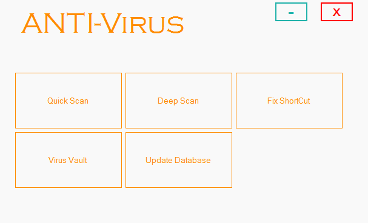

# ANTI-Virus
A Windows antivirus written in VC++.

*Disclaimer: This program is not be used in place of retailed antivirus programs out there but to be used as a fun project to get to know how the antivirus program works and tweak it accordingly. (And Download and execute this project  at your own risk as it contains some system level commands and may affect your system if not handled cautiously)*

## A naive approach to building an AntiVirus

This is a project created to understand the fundamentals of how actually an antivirus works. It was created by me and my college friend @avidLearnerInProgress as our final year project for Diploma in 2015. We were passionate about building an antivirus for windows which would benefit us in real life as well as help us to understand the inner workings and security of windows and use that knowledge to build something useful. So this was the attempt to make it real and it was quite successful at least for scanning our daily local computer viruses. It involved a lot of research and it was worth it.

As the project is made in VC++ and this repository contains only the essential source code necessary to understand and build the antivirus in visual studio. Anyone familiar with Visual Studio can compile and execute the source code on their machines. You can download the whole visual studio project from [here](https://drive.google.com/file/d/1GvDc3V3WzFZ5MEhsSywch44WEbjOedsa/view?usp=sharing) and tweak it as you like. 

## Overview of Working

Fundamentally an antivirus is a program which scans for malicious files in the machine and tries to detect, stop (if the virus is in effect), quarantine the virus inside a vault (by tweaking it and deactivating it) and  when required deleting it.

The Application we have created above is a static antivirus which scans a given directory for malicious files by,
1. Reading the internals of file if it is a batch program for if it contains any harmful commands.
2. Comparing the  hash of the file being scanned with the hash of well known viruses of which we maintain a database. (The thing which gets updated when you update an antivirus, So it is a continuous process).

As it is just a fun project we chose to use md5 hash which is not collision resistant (There are collision demos available), hence not to be used for serious projects. SHA256 and SHA512 can be used for such projects.
The hash database used in our application is very small and just for demonstration purposes only, which you can update by using Update Database option and manually adding a virus hash by giving it a virus file or finding the hash of a malicious program online and copying it in “hashes.txt” with each new hash on newline.

A dynamic antivirus (nowadays most of the antivirus try to do so but none 100% successful yet, for it would require an successful AI program to do so, which is ideal) would scan the running processes inside the main memory of the machine which might be harmful by detecting their execution behaviour at runtime.

## Interacting with the Antivirus

**Quick Scan :** Compare the hashes of files being scanned with the hash database.

**Deep Scan :** Reading files for malicious code (which can be edited in “db.txt”).

**Fix Shortcut :** Removes the annoying Flash drive shortcut virus.

**Virus Vault :** The viruses found are moved to the vault and using it you can delete those viruses.

**Update Database :** Update the antivirus database.

Other screenshots of the Antivirus are available in the Images folder of this repository.
